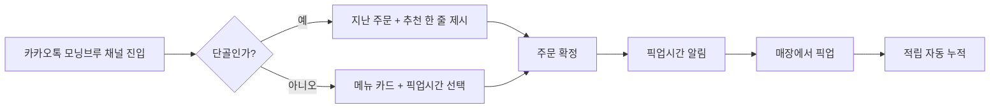

# 모닝브루 AI 매니저 — PRD

> **팀명**: 모닝브루
> **제품명**: 동네 카페를 위한 카카오톡 기반 AI 사전주문·단골 관리 매니저
> **작성일**: 2026-06-20

---

## 01. 조원 및 회사 소개

| 이름 | 소속 | 역할 | 이메일 |
|---|---|---|---|
| 김희정 | 모닝브루 | 대표 (Founder · 기획·운영) | hjkim.open@gmail.com |
| [팀원 추가 시 작성] | [소속] | [개발·기술 리드] | [이메일] |
| [팀원 추가 시 작성] | [소속] | [사용자 리서치] | [이메일] |
| [팀원 추가 시 작성] | [소속] | [KPI · 데이터 분석] | [이메일] |

---

## 02. 어떤 분야에 AI를 도입하려고 하는가

서울 망원동 동네 카페 **모닝브루**의 **출근 시간대 사전주문·단골 응대 업무**에 AI를 도입합니다. 1인 사장님이 운영하는 작은 가게에서, 카카오톡 채널 위에 올라가는 **대화형 AI 매니저**가 사전 주문을 받고 단골 손님을 알아본 뒤 메뉴를 추천합니다.

---

## 03. 현재 어떤 문제가 있는가

- **고통**: 출근 시간대(08:00~09:00) 망원동을 지나는 직장인·거주민이 "지각하겠다"는 불안 때문에 사전 주문이 안 되는 동네 카페를 그냥 지나치고 스타벅스 사이렌오더로 간다. 모닝브루는 **맛·신선도에서 경쟁력이 있는데도 출근길 1순위에서 밀린다.** 반대편에서 사장님은 출근 시간대에 주문 응대 + 핸드드립 추출 + 스콘 진열을 혼자 하느라 신규 고객 응대 품질이 떨어진다.

- **기존 대안의 한계**:
  - **스타벅스 사이렌오더**: 단골화 가장 강력 — 하지만 동네성·관계성 0, 객단가 부담.
  - **저가 프랜차이즈 자체 앱**: 가격은 압도적이나 맛·경험에서 모닝브루의 타깃이 만족하지 못함.
  - **동네 카페가 자체 앱을 만든다**: 1인 사장님이 감당할 비용·운영 부담이 비현실적.
  - **인스타 DM 사전 주문**: 형식이 자유롭고 사장님이 운영 중에 일일이 확인·답장하기 어렵다. (확인 필요 — 모닝브루의 현재 DM 운영 실태)
  - **종이 쿠폰 도장**: 잃어버리기 쉽고 단골 데이터가 사장님 머릿속에만 남는다.

- **문제의 규모**:
  - 망원역 도보권의 동네 카페가 100여 곳 규모로 추정됨 (확인 필요)
  - 그중 모바일 사전주문을 운영하는 비율은 한 자릿수 % 수준으로 보임 (확인 필요)
  - 모닝브루 기준 출근 시간대(08–09시) 잠재 객수의 약 30%를 "주문 시간 부담"으로 놓치고 있다고 가정 (확인 필요 — 1주일 현장 측정 필요)
  - 동네 카페 1곳당 연간 매출 손실 추정: 출근 객 30명/일 × 5,000원 × 250 영업일 ≈ **연 3,750만 원** (확인 필요)

---

## 04. 사용자는 누구인가

- **이름**: 박지훈 대리, 32세
- **소속**: 광화문 IT 회사 5년차, 망원동 원룸 거주
- **일과**:
  - 07:30 기상 → 07:50 망원역 2번 출구 방향으로 도보 출발
  - 08:00 망원역 진입 전 커피 한 잔(매일)
  - 08:20 합정→광화문 지하철, 09:00 사무실 도착
  - 점심 후 커피는 회사 근처 메가커피 (적립 누적용)
  - 주말은 모닝브루에서 1시간씩 책 읽고 옴
- **지불 의사**:
  - 평일 출근용 1잔: 4,000~6,000원 (사전주문·픽업 가능하다는 조건에서 모닝브루 5,500원 핸드드립 수용)
  - 주 2회 정도 모닝 세트(커피+스콘) 8,000원대까지 수용 가능 (확인 필요)
  - 사장님 입장에서는 **AI 매니저 월 구독료 5만~9만원** 수준이 도입 임계치 (확인 필요)

---

## 05. 문제 해결을 위한 AI 기능

### P0 — MVP 필수
- **카카오톡 채널 챗봇 사전주문**: 사용자가 "오늘 같은 거"·"핸드드립 한 잔"처럼 자연어로 주문하면 AI가 메뉴·옵션·픽업시간을 확정한다.
- **단골 식별 + 개인화 추천**: 채널 친구 ID로 과거 주문 이력을 불러와 "지난 주처럼 에티오피아 + 스콘 드릴까요?" 한 줄로 묻는다.
- **사장님용 주문 큐 대시보드**: 들어온 주문을 픽업 시간 순으로 정렬, 핸드드립 추출 시작 시점을 알려준다.

### P1 — 있으면 좋음
- **재고·매진 자동 안내**: 스콘 4개 남았을 때 "오늘의 스콘은 4개 남았어요" 챗봇 안내 + 자동 마감.
- **AI 적립 — "단골 보상" 자동 알림**: N잔째 방문 시 원두 1봉/스콘 쿠폰을 자동 발급, 종이 도장 없이 카카오톡으로 전달.

### P2 — 제외 (Non-Goals)
- **자체 모바일 앱 개발 — 안 함.** 1인 사장님 운영 부담과 사용자의 앱 설치 진입장벽 모두 비합리적.
- **결제 시스템 직접 구축 — 안 함.** 카카오페이/네이버페이/매장 결제로 위임.
- **딜리버리 연동 — 안 함.** 모닝브루는 픽업·매장 전용 카페 컨셉을 유지.

---

## 06. 사용자 시나리오



**Step-by-step**:
1. 박지훈 대리가 07:55 카카오톡에서 "모닝브루" 채널을 연다.
2. AI가 "지훈님, 지난 화요일처럼 핸드드립 에티오피아 한 잔 드릴까요?" 라고 묻는다.
3. "응" 한 글자로 주문 확정 → "08:10 픽업 준비됩니다. 오시면 바로 드릴게요" 응답.
4. 사장님 대시보드에 주문이 떠 08:05 핸드드립 추출을 시작한다.
5. 박 대리가 08:10 매장에서 픽업 → 적립 1회 자동 누적, "이번 주 3번째 방문이에요" 알림.

---

## 07. 화면 정의 ⭐

### 화면 S-001: 카카오톡 채널 사전주문 (고객 화면)

```
+-------------------------------+
| ☕ 모닝브루 — AI 매니저          |
+-------------------------------+
| AI: 안녕하세요 지훈님 ☀         |
|     지난 화요일처럼              |
|     · 에티오피아 핸드드립 5,500 |
|     · 수제 스콘 3,500           |
|     드릴까요?                   |
|                               |
|  [네, 같은 걸로] [메뉴 보기]    |
+-------------------------------+
| 픽업시간: 08:10 ▼              |
+-------------------------------+
| [주문 확정하기]                 |
+-------------------------------+
```

- **목적**: 출근길 손님이 3초 안에 사전 주문을 마치게 한다.
- **동작**: [주문 확정하기] 클릭 시 사장님 대시보드로 주문 푸시 + 고객에게 픽업시간 확정 메시지.
- **빈 상태 (첫 방문 고객)**: 메뉴 카드 4개(핸드드립/오늘의원두/스콘/에이드)와 픽업시간 선택만 노출.
- **에러 상태**: 매진/마감 시 상단 노란 배너 — "수제 스콘은 오늘 마감되었어요"

---

### 화면 S-002: 사장님 주문 큐 대시보드 (운영자 화면)

```
+-----------------------------------------+
| 모닝브루 · 오늘 주문 (08:00 ~ 09:00)     |
+-----------------------------------------+
| 픽업    고객      메뉴          상태     |
| 08:05  민지(단골) 라떼 1         🟢 진행 |
| 08:10  지훈(단골) 핸드드립+스콘  ⏰ 5분  |
| 08:15  신규손님  오늘원두 1      📝 대기 |
+-----------------------------------------+
| 오늘 스콘 재고: 4 / 12              [편집]|
+-----------------------------------------+
| [매진 처리] [임시 휴무] [메뉴 추가]      |
+-----------------------------------------+
```

- **목적**: 사장님이 한 화면에서 주문 큐, 추출 타이밍, 재고를 본다.
- **동작**: 5분 전 알림 자동 발생, [매진 처리] 클릭 시 챗봇이 신규 주문 차단.
- **빈 상태**: "아직 오늘 주문이 없습니다. 보통 07:55부터 들어와요" 안내.
- **에러 상태**: 챗봇/주문 동기화 실패 시 상단 빨간 배너 + 카카오톡 폴백 안내.

---

### 화면 S-003: 단골 인사이트 (사장님 주간 리포트)

```
+----------------------------------------+
| 이번 주 모닝브루                        |
+----------------------------------------+
| 총 주문: 142건 (+18% vs 지난주)         |
| 신규 단골: 9명                          |
| 가장 많이 팔린 시간대: 08:10–08:25      |
| AI가 추천한 메뉴 채택률: 74%             |
+----------------------------------------+
| 단골 추천 — "이번 주 못 본 분"          |
| · 민지님 (10일째 미방문)                |
|   [쿠폰 보내기]                         |
+----------------------------------------+
```

- **목적**: 1인 사장님이 데이터 없이도 단골 흐름을 직관적으로 본다.
- **동작**: [쿠폰 보내기] 클릭 시 챗봇이 개인화 메시지 + 쿠폰 발송.

---

## 08. 기술 요구사항 ⭐

### 기술 스택
- **언어**: TypeScript (Node.js 20)
- **프레임워크**: Next.js 16 (App Router)
- **AI**: Anthropic Claude (Sonnet 4.6 — 대화 응답·메뉴 매핑)
- **DB**: Supabase (Postgres + Realtime, Seoul 리전)
- **메시지 채널**: 카카오 비즈니스 채널 + 카카오 i 오픈빌더 webhook
- **결제**: 카카오페이 / 매장 결제로 위임 (자체 결제 없음)
- **배포**: Vercel (Edge Functions)

### 데이터 모델

```
Store
+- id: UUID (PK)
+- name: string
+- owner_id: UUID (FK)
+- biz_hours: jsonb

Customer
+- id: UUID (PK)
+- kakao_user_id: string (UNIQUE)
+- nickname: string
+- visit_count: int (default 0)
+- last_visit_at: timestamptz

Order
+- id: UUID (PK)
+- store_id: UUID (FK)
+- customer_id: UUID (FK)
+- items: jsonb (메뉴+옵션 배열)
+- pickup_at: timestamptz
+- status: enum(pending, brewing, ready, picked_up, cancelled)
+- amount: int
+- created_at: timestamptz

MenuItem
+- id: UUID (PK)
+- store_id: UUID (FK)
+- name: string (<=40)
+- price: int
+- stock_today: int (null = 무제한)
+- is_signature: boolean

ChatTurn
+- id: UUID (PK)
+- customer_id: UUID (FK)
+- role: enum(user, ai)
+- content: text
+- created_at: timestamptz
```

### 비기능 요구사항
- **챗봇 응답 시간**: p95 ≤ 1,500ms (사용자 메시지 → AI 응답 표시)
- **사장님 대시보드 갱신**: 새 주문 ≤ 2초 내 표시 (Supabase Realtime)
- **동시 사용 매장**: 50개 (MVP), 동시 채팅 세션 200개
- **단골 식별 정확도**: ≥ 95% (같은 카카오 ID 기준)
- **AI 추천 채택률**: ≥ 60% (제안한 메뉴를 그대로 주문 확정)
- **테스트 커버리지**: 백엔드 핵심 로직 ≥ 70%
- **배포 시간**: ≤ 3분 (Vercel)
- **개인정보**: 카카오 ID·닉네임만 저장, 전화번호·주소 미수집

---

## 09. 데이터 확보 방안

- **필요한 데이터**
  1. 모닝브루의 메뉴·가격·옵션 데이터 (수동 입력)
  2. 출근 시간대 1주일 실제 주문 로그 (대기 시간 측정용)
  3. 카카오 채널 친구의 대화 의도 학습용 합성 대화 100건
  4. 인근 동네 카페 5곳의 사전주문 사용 실태 (인터뷰)
- **출처**
  - **사장님 직접 입력** (메뉴·재고): 난이도 하
  - **현장 측정** (1주일, 모닝브루): 난이도 중 — 사장님 협조 필요
  - **합성 대화 생성** (Claude 활용): 난이도 하
  - **고객 인터뷰** (5~10명): 난이도 중 — 평일 아침 망원역 일대
- **저작권·개인정보**
  - 고객 대화 로그는 익명화(카카오 ID → 해시) 후 학습용으로만 사용
  - 메뉴 사진·로고는 모닝브루 소유 자료만 사용, 외부 카페 자료는 사용하지 않음
  - 개인정보처리방침 페이지를 카카오 채널 메뉴에 노출 (확인 필요 — 카카오 채널 정책 요건)

---

## 10. 구현 방안 및 일정

| Phase | 기간 | 목표 | 완료 조건 |
|---|---|---|---|
| Phase 1 | 1주차 | 백엔드 스캐폴딩 + DB 모델 | Supabase 5개 테이블 생성, REST API 4개 200 응답 |
| Phase 2 | 2주차 | Claude 챗봇 핵심 로직 | "오늘 같은 거" 같은 자연어 주문이 정확한 Order JSON으로 변환됨 (pytest 통과) |
| Phase 3 | 3주차 | 카카오 채널 webhook + 사장님 대시보드 | 카카오톡 채널에서 주문이 들어와 대시보드에 2초 내 표시됨 |
| Phase 4 | 4주차 | 모닝브루 실사용 테스트 + 배포 | 1주일 실매장 운영, URL 접속 가능, 출근 시간대 주문 ≥ 20건 |

각 Phase는 5~15분 작업량의 Task들로 구성됩니다.

---

## 11. 성과 측정 방법 (KPI)

| KPI | 목표 값 |
|---|---|
| 출근 시간대(08–09시) 사전주문 비율 | ≥ 40% (전체 주문 중) |
| AI 추천 메뉴 채택률 | ≥ 60% |
| 단골 식별 정확도 | ≥ 95% |
| 첫 주문 → 재방문 전환율 (4주 내) | ≥ 35% |
| 사장님 주문 응대 시간 절감률 | ≥ 50% |
| 챗봇 응답 시간 p95 | ≤ 1,500ms |
| 사장님 만족도 (5점 척도) | ≥ 4.3 |

모두 기계가 측정 가능한 숫자로 기재합니다.

---

## 12. 팀원별 역할 분담

| 팀원 | 담당 섹션 | 담당 기능 | Git 커밋 범위 |
|---|---|---|---|
| 김희정 | 02·03·04·11 | 사업 기획 · 사용자 정의 · KPI 설계 · 매장 운영 검증 | docs/, prd/ |
| [기술 리드] | 08·10 (Phase 1·2) | DB 모델링 · Claude 챗봇 로직 · API | api/, lib/ai/ |
| [프론트 리드] | 07·10 (Phase 3) | 사장님 대시보드 UI · 카카오톡 채널 메시지 카드 | app/, components/ |
| [데이터·KPI] | 09·11 | 데이터 수집 · KPI 대시보드 · 실사용 테스트 분석 | analytics/, tests/ |

---

> **다음 단계**
> 1. Day02 고객 불편 조사·경쟁사 분석에서 도출된 **(확인 필요)** 항목 검증 (1주일 현장 측정 + 인터뷰)
> 2. 카카오 비즈니스 채널 사전 등록 신청 (확인 필요 — 신청부터 승인까지 소요 기간)
> 3. Phase 1 백엔드 스캐폴딩 착수
